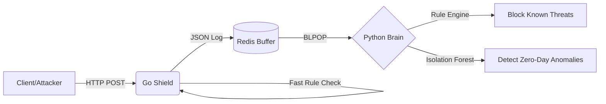

# 🛡️ Sentinel: Distributed Threat Detection Engine

## 1. Project Overview
**Sentinel** is a cloud-native, distributed security system designed to bridge the gap between high-speed traffic ingestion and deep-learning threat analysis.

* **The Problem:** Traditional Web Application Firewalls (WAFs) face a trade-off: they are either fast but "dumb" (catching only known signatures) or smart but slow (causing latency for users).
* **Who It’s For:** Cloud Security Engineers and DevSecOps teams looking for a scalable, microservices-based approach to threat detection.
* **Core Idea:** Sentinel uses a **"Funnel Architecture."** A high-performance Go ingestor acts as a speed gate, filtering traffic instantly. Suspicious or complex data is buffered in Redis and processed asynchronously by a Python-based ML engine, ensuring zero latency for the end-user while maintaining deep security coverage.

## 2. System Architecture Diagram



## 3. Key Features

### Hybrid Detection Engine
Combines ultra-fast signature matching (rule-based detection) with an unsupervised machine learning model (Isolation Forest) to detect both known exploits and zero-day anomalies.

### Asynchronous Processing
Decouples traffic ingestion from analysis using Redis, enabling the system to handle traffic spikes without overwhelming the detection engine.

### Resilient Design
Implements data persistence mechanisms to ensure logs survive service crashes. Crash recovery behavior ("Nuclear Resurrection") has been tested.

### Microservices Architecture
Each core component (Ingestion, Queue, Analysis) runs in its own Docker container, allowing independent scaling and isolation.

### Real-Time Anomaly Detection
Capable of identifying obfuscated payloads and statistically abnormal request patterns that may bypass traditional WAF rules.

---

## 4. Tech Stack

### Backend (Ingestion Service)
- Golang (net/http)

### Backend (Dashboard – In Progress)
- Java (Spring Boot, WebSockets)

### Message Queue
- Redis (Lists, Pub/Sub)

### Machine Learning Engine
- Python (Scikit-Learn, NumPy, Joblib)

### Deployment
- Docker
- Docker Compose

---

## 5. Quick Start

### Prerequisites

- Docker
- Docker Compose

---

### Steps to Run

#### 1. Clone the Repository

```bash
git clone https://github.com/yourusername/sentinel.git
cd sentinel
```

#### 2. Start the Stack


```bash
docker-compose up --build
```
#### 3. Test the Detection Engine

``` bash
Test Legitimate Traffic
curl -X POST http://localhost:8080/ingest \
-d '{"source_ip":"192.168.1.1","payload":"login_success","request_type":"HTTP"}'
Test a Known Threat (Rule Trigger)
curl -X POST http://localhost:8080/ingest \
-d '{"source_ip":"10.0.0.5","payload":"<script>alert(1)</script>","request_type":"HTTP"}'
Test an Anomaly (ML Trigger)
curl -X POST http://localhost:8080/ingest \
-d '{"source_ip":"66.66.66.66","payload":"A8#kL@!9&$$((%^))__~??/\\x90\\x90","request_type":"HTTP"}'
```

#### 4. View Logs

Monitor the running containers to observe the detection engine flagging malicious or anomalous traffic in real time.


---


